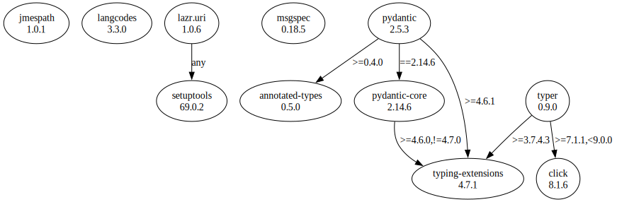

# Third Party Dependencies

<!--[[[fill sbom_sha256()]]]-->
The [SBOM in CycloneDX v1.4 JSON format](https://git.sr.ht/~sthagen/turvallisuusneuvonta/blob/default/sbom/cdx.json) with SHA256 checksum ([a63d7adc ...](https://git.sr.ht/~sthagen/turvallisuusneuvonta/blob/default/sbom/cdx.json.sha256 "sha256:a63d7adc1fc1bb1c3478406950fbe96cb31c4cf2c5123157e94fa77165470430")).
<!--[[[end]]] (checksum: d393704c25167df94d7e4f1cb0356ef0)-->
## Licenses

JSON files with complete license info of: [direct dependencies](direct-dependency-licenses.json) | [all dependencies](all-dependency-licenses.json)

### Direct Dependencies

<!--[[[fill direct_dependencies_table()]]]-->
| Name                                                | Version                                               | License                                             | Author                 | Description (from packaging data)                                                                        |
|:----------------------------------------------------|:------------------------------------------------------|:----------------------------------------------------|:-----------------------|:---------------------------------------------------------------------------------------------------------|
| [jmespath](https://github.com/jmespath/jmespath.py) | [1.0.1](https://pypi.org/project/jmespath/1.0.1/)     | MIT License                                         | James Saryerwinnie     | JSON Matching Expressions                                                                                |
| [langcodes](https://github.com/rspeer/langcodes)    | [3.3.0](https://pypi.org/project/langcodes/3.3.0/)    | MIT License                                         | Elia Robyn Speer       | Tools for labeling human languages with IETF language tags                                               |
| [lazr.uri](https://launchpad.net/lazr.uri)          | [1.0.6](https://pypi.org/project/lazr.uri/1.0.6/)     | GNU Library or Lesser General Public License (LGPL) | "LAZR Developers" team | A self-contained, easily reusable library for parsing, manipulating,                                     |
| [msgspec](https://jcristharif.com/msgspec/)         | [0.18.0](https://pypi.org/project/msgspec/0.18.0/)    | BSD License                                         | Jim Crist-Harif        | A fast serialization and validation library, with builtin support for JSON, MessagePack, YAML, and TOML. |
| [pydantic](https://github.com/pydantic/pydantic)    | [1.10.10](https://pypi.org/project/pydantic/1.10.10/) | MIT License                                         | Samuel Colvin          | Data validation and settings management using python type hints                                          |
| [typer](https://github.com/tiangolo/typer)          | [0.9.0](https://pypi.org/project/typer/0.9.0/)        | MIT License                                         | Sebastián Ramírez      | Typer, build great CLIs. Easy to code. Based on Python type hints.                                       |
<!--[[[end]]] (checksum: 0c62951bcb2787a14126d5d701558a1a)-->

### Indirect Dependencies

<!--[[[fill indirect_dependencies_table()]]]-->
| Name                                                             | Version                                                    | License                            | Author                                                                                | Description (from packaging data)                                       |
|:-----------------------------------------------------------------|:-----------------------------------------------------------|:-----------------------------------|:--------------------------------------------------------------------------------------|:------------------------------------------------------------------------|
| [click](https://palletsprojects.com/p/click/)                    | [8.1.6](https://pypi.org/project/click/8.1.6/)             | BSD License                        | UNKNOWN                                                                               | Composable command line interface toolkit                               |
| [setuptools](https://github.com/pypa/setuptools)                 | [68.0.0](https://pypi.org/project/setuptools/68.0.0/)      | MIT License                        | Python Packaging Authority                                                            | Easily download, build, install, upgrade, and uninstall Python packages |
| [typing_extensions](https://github.com/python/typing_extensions) | [4.7.1](https://pypi.org/project/typing_extensions/4.7.1/) | Python Software Foundation License | "Guido van Rossum, Jukka Lehtosalo, Łukasz Langa, Michael Lee" <levkivskyi@gmail.com> | Backported and Experimental Type Hints for Python 3.7+                  |
<!--[[[end]]] (checksum: a00db70e9e0f16e7e30b78cc86a5a0c7)-->

## Dependency Tree(s)

JSON file with the complete package dependency tree info of: [the full dependency tree](package-dependency-tree.json)

### Rendered SVG

Base graphviz file in dot format: [Trees of the direct dependencies](package-dependency-tree.dot.txt)



### Console Representation

<!--[[[fill dependency_tree_console_text()]]]-->
````console
jmespath==1.0.1
langcodes==3.3.0
lazr.uri==1.0.6
└── setuptools [required: Any, installed: 68.0.0]
msgspec==0.18.0
pydantic==1.10.10
└── typing-extensions [required: >=4.2.0, installed: 4.7.1]
typer==0.9.0
├── click [required: >=7.1.1,<9.0.0, installed: 8.1.6]
└── typing-extensions [required: >=3.7.4.3, installed: 4.7.1]
````
<!--[[[end]]] (checksum: da02f27777e52dd8748c925f12d8f449)-->
